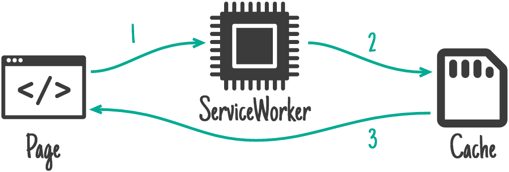

# Prefetching, prerendering, and service worker precaching

In the last couple of modules, you discovered concepts such as deferring the
loading of JavaScript and lazy loading images and `<iframe>` elements.
Deferring resource loading decreases network and CPU usage during the initial
page load by downloading resources at the point in which they are needed,
rather than loading them up front, where they could potentially go unused.
This can improve initial page load times, but subsequent interactions may incur
a delay if the resources needed to power them aren't already loaded at the time
they occur.

For example, if a page contains a custom date picker, you can defer the date
picker's resources until the user interacts with the element. However, loading
the date picker's resources on demand can result in a delay—perhaps slight, but
perhaps not, depending on the user's network connection, device capabilities, or
both—until the resources are downloaded, parsed, and available for execution.

It's a bit of a tricky balance—you don't want to waste bandwidth by loading
resources that can go unused, but delaying interactions and subsequent page
loads may not be ideal either. Thankfully, there are a number of tools you can
use to strike a better balance between these two extremes—and this module covers
some techniques you can use to get there, such as prefetching resources,
prerendering entire pages, and precaching resources using a service worker.

## Prefetch resources needed in the near future at low priority

It's possible to preemptively fetch resources—including images, stylesheets,
or JavaScript resources—by using the `<link rel="prefetch">` resource hint. The
prefetch hint informs the browser that a resource is likely to be required in
the near future.

When a prefetch hint is specified, the browser may then initiate a request
for that resource at lowest priority to avoid contending with resources
required for the current page.

> [!NOTE]
> The prefetch resource hint is just that—a hint. Browsers may decide—based on a set of conditions around
network quality, system-level preferences or other factors—whether or not to
honor a prefetch hint.

Prefetching resources can improve the user experience, as the user is not
required to wait for resources needed in the near future to be downloaded, as
they can be instantly retrieved from the disk cache at the time of need.

```html
<head>
  <!-- ... -->
  <link rel="prefetch" as="script" href="/date-picker.js">
  <link rel="prefetch" as="style" href="/date-picker.css">
  <!-- ... -->
</head>
```

The preceding HTML snippet informs the browser that it can prefetch
date-picker.js and date-picker.css once it is idle. It's is possible to also
prefetch resources dynamically as the user interacts with the page in
JavaScript.

Prefetch is supported on all modern browsers except Safari—where it is
available behind a flag. If you have a strong need to preemptively load
resources for your website in a way that works in all browsers—and you're using
a service worker—then read the later section in this module about precaching
resources using a service worker.

## Prefetch pages to speed up future navigations

It's also possible to prefetch a page and all its subresources by specifying the
`as="document"` attribute when pointing to an HTML document:

```html
<link rel="prefetch" href="/page" as="document">
```

When the browser is idle, it may initiate a low priority request for /page.

> [!IMPORTANT]
> It's generally advised to avoid using `<link rel="prefetch">` to prefetch cross-origin
documents. There is an open issue related to prefetching cross-origin documents that results in duplicate
requests. You should also avoid prefetching same-origin documents that are
personalized—for example, HTML responses dynamically generated for
authenticated sessions—as such resources are typically not cached and are
highly likely to go unused, ultimately wasting bandwidth.

In Chromium-based browsers, you can prefetch documents using the
Speculation Rules API. The Speculation Rules are defined as a JSON object
included in the page's HTML, or added dynamically through JavaScript:

```html
<script type="speculationrules">
{
  "prefetch": [{
    "source": "list",
    "urls": ["/page-a", "/page-b"]
  }]
}
</script>
```

The JSON object describes one or more actions—currently supporting only
prefetch and prerender—and a list of URLs associated with that action. In
the preceding HTML snippet, the browser is instructed to prefetch /page-a
and /page-b. Similarly to `<link rel="prefetch">`, speculation rules are a
hint that the browser may ignore under certain circumstances.

> [!NOTE]
> While `<link rel="prefetch">` prefetches resources and
stores them in the HTTP cache, prefetches loaded using speculation rules are
processed and stored in the memory cache, which makes them quicker to retrieve
when needed.

Libraries such as Quicklink improve page navigations by dynamically
prefetching or prerendering links to pages once they are visible within the
user's viewport. This increases the likelihood that the user eventually
navigates to that page—compared with prefetching all links on the page.

> [!IMPORTANT]
> Prefetching resources could result in the
user downloading resources that may end up unused. When prefetching resources,
be cautious to only use it when necessary, only on fast
connections, and avoid prefetching altogether if the user has enabled the
Save-Data signal.

## Prerender pages

In addition to prefetching resources, it is also possible to hint to the browser
to prerender a page before the user navigates to it. This can deliver nearly
instant page loads, as the page and its resources are fetched and processed in
the background. Once the user navigates to the page, the page is placed in the
foreground.

Prerendering is supported through the Speculation Rules API:

```html
<script type="speculationrules">
{
  "prerender": [
    {
      "source": "list",
      "urls": ["/page-a", "page-b"]
    }
  ]
}
</script>
```

> [!NOTE]
> Chrome also supports the `<link rel="prerender" href="/page">`
resource hint. However, since Chrome 63, this initiates a NoState
Prefetch that fetches resources needed by the page, rather than rendering
the page and executing JavaScript.

> [!IMPORTANT]
> A full prerender also executes the JavaScript
on the page that is being prerendered. Given that JavaScript can be both a
fairly large and computationally expensive type of resource, it's recommended
to use `prerender` sparingly, and only in cases when you're fairly certain
that the user intends to navigate to the prerendered page.

## Prefetch and prerender demos

## Service worker precaching

It's also possible to speculatively prefetch resources using a service worker.
Service worker precaching can fetch and save resources using the Cache API,
allowing the browser to serve the request using the Cache API without going to
the network. Service worker precaching uses a very effective service worker
caching strategy, known as the cache-only strategy. This pattern is highly
effective because, once resources are placed in the service worker cache, they
are fetched almost instantly upon request.




*The cache-only strategy only ever retrieves eligible resources from the network during the service worker's installation. Once installed, the cached resources are only ever retrieved from the service worker cache.*

> [!IMPORTANT]
> In the near future, a module is planned for
this course that goes into detail on various performance optimizations that
a service worker can provide, such as runtime
caching.

To precache resources using a service worker, you can use Workbox. If you
prefer, however, you can write your own code to cache a predetermined set of
files. Either way you decide to go about using a service worker to precache
resources, it's important to know that precaching happens when the service
worker is installed. After installation, the precached resources are then
available for retrieval on any page the service worker controls on your website.

> [!IMPORTANT]
> While you can certainly write your own
service worker from scratch, using Workbox is helpful for precaching in
particular in that it keeps track of versioning information for resources that
get cached. Then, if you update your service worker in the future, Workbox
automatically removes expired entries from the cache, saving you the fair bit
of effort it takes to do this on your own.

Workbox uses a precache manifest to determine which resources should be
precached. A precache manifest is a list of files and versioning information
that serves as the "source of truth" for the resources to be precached.

```json
[{
    url: 'script.ffaa4455.js',
    revision: null
}, {
    url: '/index.html',
    revision: '518747aa'
}]
```

The preceding code is an example manifest which includes two files:
script.ffaa4455.js and /index.html. If a resource contains version
information in the file itself (known as a file hash), then the revision
property can be left as null, as the file is already versioned (for example,
ffaa4455 for the script.ffaa4455.js resource in the preceding code). For
unversioned resources, a revision can be generated for them at build time.

Once set up, a service worker can be used to precache static pages or their
subresources to speed up subsequent page navigations.

```javascript
workbox.precaching.precacheAndRoute([
  '/styles/product-page.ac29.css',
  '/styles/product-page.39a1.js',
]);
```

For example, on an ecommerce product listing page, a service worker can be used
to precache the CSS and JavaScript required to render the product detail page,
making the navigation to the product detail page feel much faster. In the
preceding example, product-page.ac29.css and product-page.39a1.js are
precached. The precacheAndRoute method available in workbox-precaching
automatically registers the handlers needed to ensure the precached resources
are fetched from the service worker API whenever necessary.

Since service workers are widely supported, you can use service worker
precaching on any modern browser where the situation calls for it.

> [!NOTE]
> The Cache interface used by the service worker and the HTTP cache are not the same.
The Cache interface is a high-level cache controlled by
JavaScript, whereas the HTTP cache is a low-level cache that is controlled by
Cache-Control headers.

> Similarly to prefetching or prerendering resources using resource hints or
speculation rules, service worker precaching consumes network bandwidth,
storage, and CPU. It's recommended to only precache resources that are likely
to be used, and to specifying too many resources in a precache manifest. When
in doubt, it's better to precache too little than too much, and rely on
runtime caching to populate the service worker cache using one of a
variety of patterns to balance speed and resource freshness. For more information
on what to do—and what not to do—when precaching resources, read
Precaching dos and don'ts.

## Test your knowledge

- At what priority does a prefetch hint occur?  
  ◯ High  
  ◯ Medium  
  ◯ Low

- What is the difference between prefetching and
prerendering a page?  
  ◯ They're mostly the same, only a prerender gets all of a page's subresources while a prefetch doesn't.  
  ◯ While both a prefetch and a prerender for a page gets a page and all of
its subresources, a prefetch only retrieves the page and all of its
resources while a prerender goes one step further by rendering the
entire page the background until the user navigates to it.

- The service worker cache and the HTTP cache are the same.  
  ◯ False  
  ◯ True

## Up next: An overview of web workers

Now that you know how prefetching, prerendering, and service worker precaching
can be beneficial can be when it comes to speeding up navigations to future
pages, you're in a position to make some educated decisions on how this can be
beneficial for your website and its user.

Next up, an overview of web workers is given, and how they can take expensive
work off of the main thread and give the main thread more breathing room for
user interactions. If you've ever wondered what you could do to give the main
thread more breathing room, then the next two modules are worth your time!
